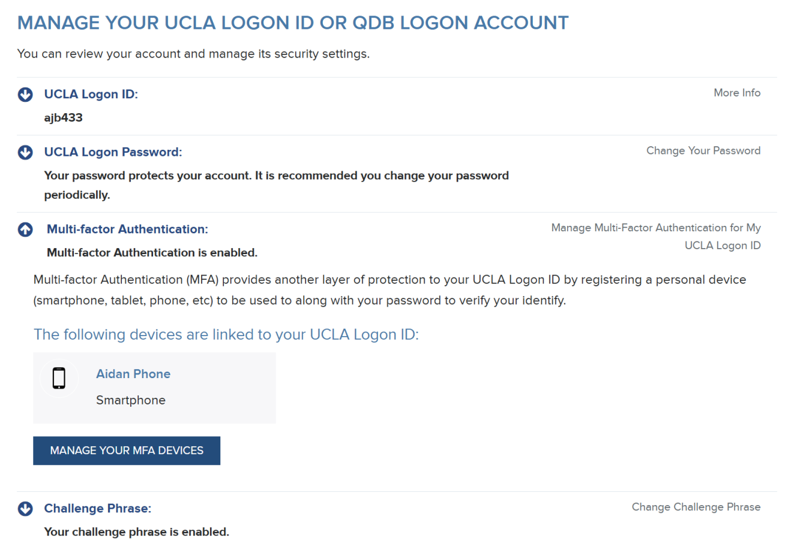

#  Part 1: Post on your Blog a statement that you have established two-factor authentication at UCLA, and, if possible, give a screenshot attesting to this establishment. 

# Part 2: Post as text, not as an attached file, on your Blog a short report of . . . your thoughts about using such a computational tool to establish a dataset that would let you explore some question about cognition. It might be easiest if you think of a research question that has to do with language, gesture, and multimodal communication. 
I think using similar search engines is a good tool for establishing a dataset to explore deeper questions about cognition. Although this red hen search engine primarily focuses on News headlines, it could definitly be useful for political sciences and staying on top of current events. However, one should probably use a different searching mechanism if they are trying to generate a dataset for higher level academia research. That being said, utilizing search engines to gather a large amount of resources to learn is quite good. But it is important to fact check the sources and ensure credibility and relevance. 
