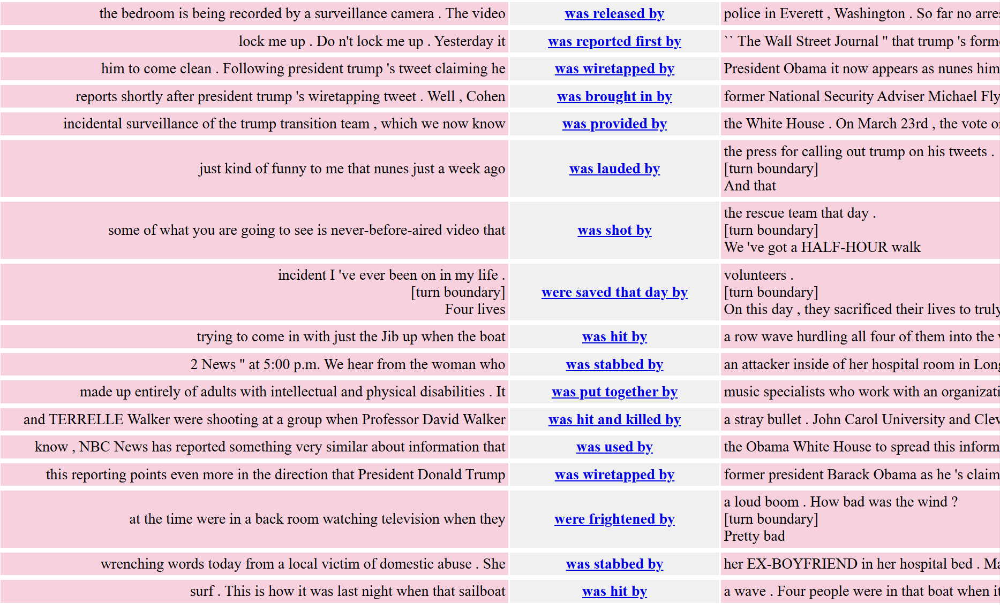

# Now post on your student page: examples of some linguistic pattern you find interesting (not just a string, but something with grammatical structure), and a query you have designed that you could use in CQPweb to search for that pattern. Then issue the query in CQPweb, adjust the query as needed, and post some results on your student page.
After looking into grammar structure and reading through the CQP syntax, I decided to look at past tense passive voice. Essentially, the passive voice takes the form of an auxiliary verb then a past participle. For example the phrases “was eaten”, “was hit by”, and “was baked by” are examples of passive voice. The purpose of this is to shift the focus away from the doer, and instead focus on the action itself or the recipient. 

To query this, I used the following query:
[lemma="be" & pos="VBD"] [pos="VBN"] []{0,3} [lemma="by"]

This simply looks for past tenses of “be” (was, were) followed by a past participle (made, eaten, etc). The “by” lemma at the end of the query allows for up to 3 words after the participle and before the word “by” to allow for any adverbs or modifiers. As such, I ended up with the following results:
[]