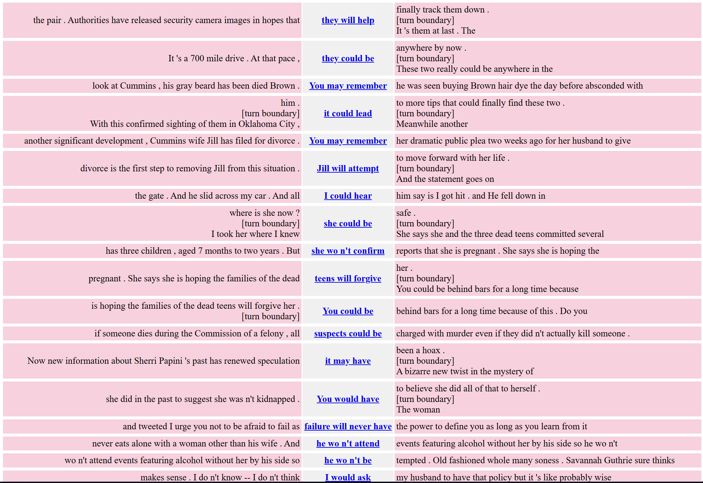

# CQP 2 (prompt too long so I wont copy pasta the whole thing)
I believe my CQP 1 prompt had already satisfied the 3 CQP query syntax requirements but I will not just be copying the same prompt. Instead, I created the following query: [pos="NN|NNS|NNP|NNPS|PRP"][pos="MD"][pos="RB"]?[pos="VB"]

This query targets sentences with subject, then a modal verb, followed by an adverb (optional), then an infinitive verb.

To better understand the query:
- Subject: A subject is a noun or pronoun ([pos="NN|NNS|NNP|NNPS|PRP"])
- Modal Verb: A modal verb is a verb that adds to another verb ([pos="MD"])
- Adverb: An adverb is a verb that modifies another verb ([pos="RB"])
    - Adverb is optional, signified by the question mark
- Infinitive Verb: An infinitive verb is a verb that does not take a direct object ([pos="VB"])

Example sentences that match this query:
- He could easily win
- Dogs must loudly bark

After running the query these were my results:

