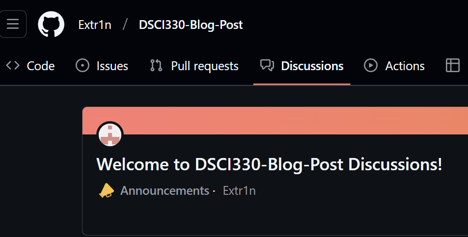

# This is Aidan Bugayong's Blog Post for DSCI330 (Cognition and Computation). Here I will discuss various topics for the class.
## Final Project Prompt READY!
Hello all who read this, my final project is a tool for looking at how external pressures can contribute to student's mental health. In the 2025-02-12 file, I have my prompt which is ready for chatgpt's deep research.
## How to Comment
If you select the discussions tab, simply click on a discussion you wish to comment on. Some discussions will simply link to the file I originally worked on while others will be copy and pasted directly into the discussion.

